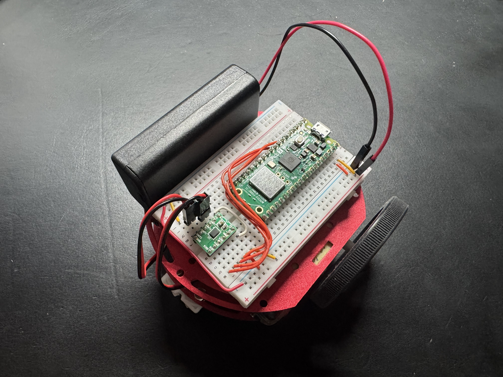

# PicoRuby RC Car

A BLE-controlled RC car powered by [PicoRuby](https://github.com/picoruby/picoruby) on a Raspberry Pi Pico2 W. Control it wirelessly from your browser using a virtual joystick.

## Materials

| Part | Link |
|------|------|
| RC Car Chassis | https://akizukidenshi.com/catalog/g/g113651/ |
| Raspberry Pi Pico2 W | https://akizukidenshi.com/catalog/g/g130330/ |
| DRV8835 Motor Driver Module | https://akizukidenshi.com/catalog/g/g109848/ |
| Breadboard | https://akizukidenshi.com/catalog/g/g100315/ |
| Jumper Wires (any wires will do) | https://akizukidenshi.com/catalog/g/g102315/ |
| Battery Box | https://akizukidenshi.com/catalog/g/g111523/ |
| 2x AA Batteries | - |

## Wiring

Connect the Raspberry Pi Pico2 W to the DRV8835 motor driver module:

| Pico GPIO | DRV8835 | Function |
|-----------|---------|----------|
| GP5 | AIN1 | Right Motor Forward |
| GP6 | AIN2 | Right Motor Reverse |
| GP7 | BIN1 | Left Motor Forward |
| GP8 | BIN2 | Left Motor Reverse |

## Flashing

Use the [PicoRuby Terminal](https://picoruby.org/terminal) to write the firmware to your Raspberry Pi Pico2 W.

1. Write `car.rb` as `/home/app.rb` on the Pico2 W (Plain text)
2. Write [`ble_uart.rb`](https://github.com/picoruby/picoruby/blob/master/mrbgems/picoruby-ble-uart/mrblib/ble_uart.rb) as `/lib/ble-uart.mrb` on the Pico2 W (**Compile** mode, not Plain)

## Usage

1. Power on the RC car
2. Open the controller page: https://hayaokimura.github.io/picoruby-rc-car/
3. Click the **Connect** button to pair with the RC car via BLE
4. Drag the joystick knob to drive!

> **Note:** Safari on iPhone does not support the Web Bluetooth API. To control the RC car from an iPhone, use a Web Bluetooth compatible browser such as [Bluefy](https://apps.apple.com/app/bluefy-web-ble-browser/id1492822055).

## License

MIT
